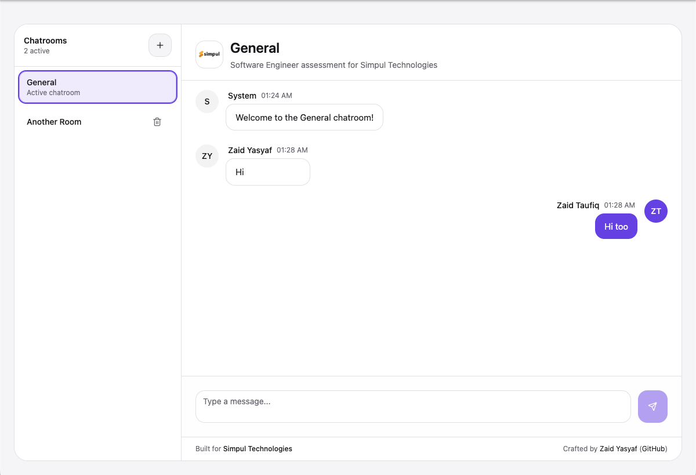
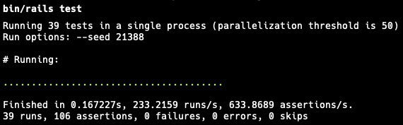

# Simpul Chat

Simpul Chat is a full-stack real-time chat application delivered as the Software Engineer assessment for **Simpul Technologies**. The project demonstrates how I (Zaid Yasyaf) approach production-ready, real-time experiences using Ruby on Rails, Action Cable, React Query, and Tailwind UI components.



## Project Structure

```
simpul-chat/
├── backend/   # Ruby on Rails 8 API + Action Cable + MySQL + Redis
└── frontend/  # Vite + React + TypeScript + Tailwind + shadcn/ui
```

## Features

- Real-time chat powered by Rails Action Cable and Redis
- Create and delete chatrooms with live updates across connected clients
- Default "General" chatroom is always present; users are redirected to it automatically if their room is removed
- Enforces unique display names across online users with Redis-backed presence tracking
- Modern React UI with shadcn/ui components, Tailwind styling, and React Query data fetching
- Comprehensive API + channel test coverage (models, controllers, Action Cable)

## Requirements

- **System**: macOS or Linux with Homebrew (or equivalent), Git, and a modern shell
- **Backend**
  - Ruby 3.3+ (managed via rbenv or asdf)
  - Bundler 2.7+
  - MySQL 8 (or compatible) reachable from your machine
  - Redis 7 for Action Cable pub/sub
  - Node.js 18+ (Rails 8 import maps rely on Node for bundling ancillary JS)
- **Frontend**
  - Node.js 18+ and npm 9+ (pnpm/yarn work too, but npm is assumed)

## Installation

### 1. Clone the repository

```bash
git clone https://github.com/zaidysf/simpul-chat.git
cd simpul-chat
```

### 2. Backend setup

```bash
cd backend
cp .env.example .env   # adjust values for your MySQL/Redis setup
bundle install         # install Ruby gems (pulls in redis + dotenv)
bin/rails db:create db:migrate db:seed
```

If you prefer a socket connection (e.g., via DBngin), set `DB_SOCKET` in `.env` and remove `DB_HOST`/`DB_PORT` entries.

> **About `.env` in production:** `dotenv-rails` is available in the production group, so the server will automatically read a `.env` file when it boots—handy for containerized deployments or bare-metal boxes where exporting dozens of variables is tedious. Keep the file out of version control and place it on the host (or mount it as a secret). You can also point to an alternative file with `DOTENV_PATH`.

**Important keys in `.env`:**

- `DB_USERNAME` / `DB_PASSWORD` - Database credentials (development/test)
- **`BACKEND_DATABASE_USERNAME` / `BACKEND_DATABASE_PASSWORD`** - **Required for production**. Rails 8 uses multiple databases (primary, cache, queue, cable) in production and requires these separate credentials.
- `DB_NAME_PREFIX` or `DB_NAME_*` overrides - Rename databases from the default `simpul_chat_*`
- `REDIS_URL` - Main Redis connection (default: `redis://127.0.0.1:6379/1`)
- **`REDIS_PRESENCE_URL`** - Redis for presence tracking (default: `redis://127.0.0.1:6379/2`). Set this to avoid conflicts.
- **`FRONTEND_ORIGIN`** - Frontend URL for CORS/Action Cable (e.g., `http://localhost:5173` or `https://yourdomain.com`). **Required for production**.

### 3. Frontend setup

```bash
cd ../frontend
cp .env.example .env   # adjust API URL if backend runs elsewhere
npm install
```

**For production builds:**

Vite automatically reads `.env`, `.env.local`, and mode-specific files like `.env.production`. These variables are **embedded at build time**.

```bash
cd frontend
cp .env.production.example .env.production
# Edit .env.production with your production URLs:
# VITE_API_URL=https://your-backend-domain.com
# VITE_CABLE_URL=wss://your-backend-domain.com/cable
npm run build
```

The built files will be in `frontend/dist/` and should be served by a web server (nginx, Apache, etc.).

## Local Development

### Backend

```bash
cd backend
dotenv bin/rails server    # requires `dotenv-rails`; otherwise export env vars manually
```

This starts Rails on `http://127.0.0.1:3000`. Ensure Redis is running (default `redis://127.0.0.1:6379/1`). Update `.env` if your Redis URL differs.

### Frontend

```bash
cd frontend
npm run dev
```

By default Vite serves the UI on `http://localhost:5173`. The app reads `VITE_API_URL` and `VITE_CABLE_URL` to talk to the Rails server and Action Cable respectively.

## Running Tests

```bash
cd backend
bundle exec rails test
```

All 39 tests should pass (100% pass rate). Frontend unit tests are not bundled yet; you can add Vitest/Jest as needed.



## Branding & Author

- **Brand**: Simpul Chat — assessment project for Simpul Technologies
- **Author**: [Zaid Yasyaf](https://uncle-z.com) ([github.com/zaidysf](https://github.com/zaidysf))

## License

MIT License. See [LICENSE](LICENSE).
